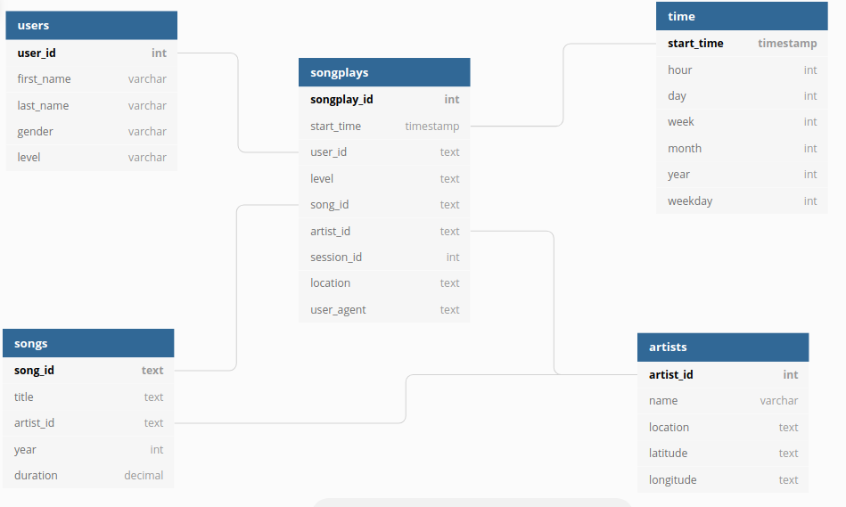

# SPARKIFY DATABASE SCHEMA MODEL (STAR SCHEMA)

## INTRODUCTION

A startup called Sparkify wants to analyze the data they've been collecting on songs and user activity on their new music streaming app. The analytics team is particularly interested in understanding what songs users are listening to. Currently, they don't have an easy way to query their data, which resides in a directory of JSON logs on user activity on the app, as well as a directory with JSON metadata on the songs in their app.

## STAR SCHEMA

This is the simplest way to structure tables in a database. As can be seen above the structure looks like a star. This is a combination of a central fact tables surrounded by related dimension tables. 

This is optimized for querying large datasets and it is easy to understand. Dimension tables are linked to the fact table with foreign keys.

## ETL PIPELINE
This project contains the data folder which has the datasets.
It has the test.ipynb to test for observations in database.
etl.py contains the finished etl pipeline from the etl.ipynb.
Also we have the sql_queries file which contains all the sql queries for creation of tables, insertion and droping.
Lastly, the create_tables.py is used to create the database, drop and create tables depending on existence and close the connection to database.

To run script:
1. Make sure to run create_tables.py first to create database.
2. Next, run etl.py.
Hopefully everything goes well
3. Finally run each cell in test.ipynb to make sure the tables are created with data inserted.
